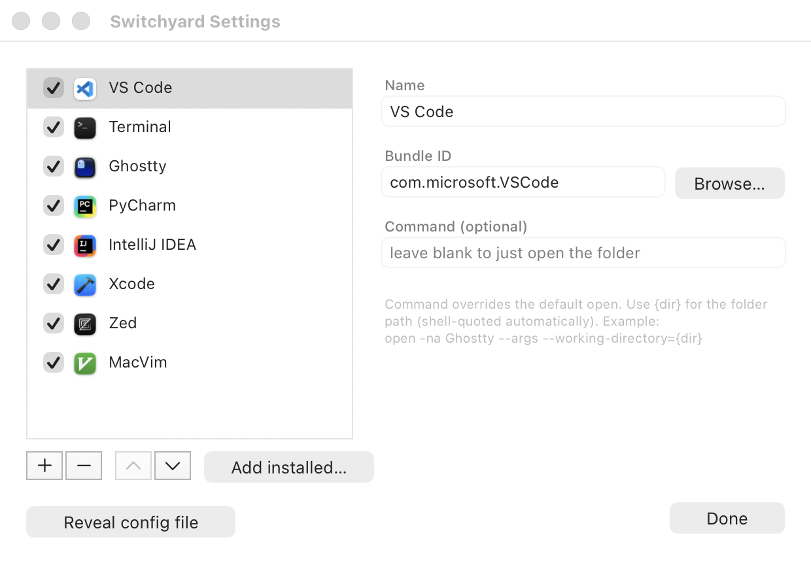

# Switchyard

A macOS Finder toolbar button that opens the **current folder** in the app you pick —
VS Code, a terminal, an IDE, whatever you configure. Inspired by the Linux app
[Junction](https://github.com/sonnyp/Junction).

<p align="center">
  
</p>

## Install

1. Download `Switchyard.dmg` from the [latest release](../../releases/latest).
2. Open it and drag **Switchyard** to **Applications**.
3. It's not notarized, so clear the quarantine flag once:
   ```bash
   xattr -dr com.apple.quarantine /Applications/Switchyard.app
   ```
4. Open a Finder window, hold **⌘** and **drag `Switchyard.app` onto the toolbar**.
5. Click it once and approve the *"control Finder"* prompt.

## Use

Click the toolbar button → pick an app → it opens the current Finder folder there.
Click the **gear** (or **⌥-click** the toolbar button) to open **Settings**, where you
can add/remove/reorder apps, enable/disable them, or **Add installed…** to auto-detect
supported apps.

## Build from source

Needs the Xcode Command Line Tools (`xcode-select --install`).

```bash
./build.sh        # -> build/Switchyard.app
./package.sh      # -> dist/Switchyard.dmg and dist/Switchyard.zip
```

## License

MIT
